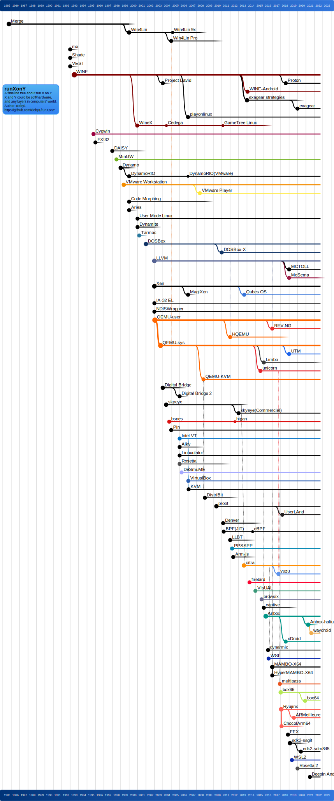
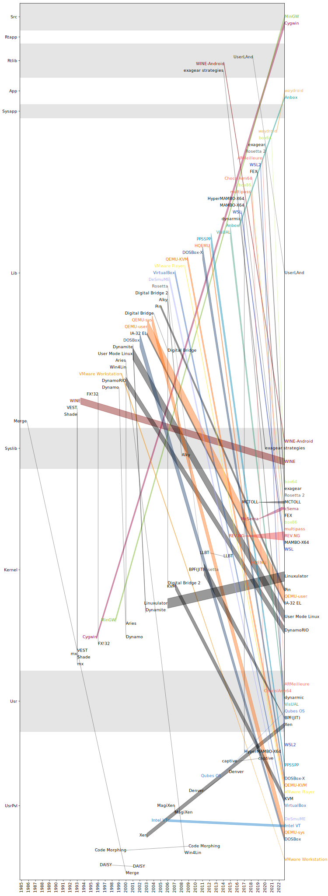

# runXonY

A repo tracking tech of emulator/simulator/translator/virtualizer/...,
and any related tech can run X (guest) on Y (host).
X and Y could be soft/hardware, and any layers in computers' world.

## Timeline

Inspired by [Linux Distribution Timeline](https://github.com/FabioLolix/LinuxTimeline)

## Host-guest Relplot

## Contributing

😃Feel free to

* add new techs
* add new feats

by opening issues or pulling requests.
