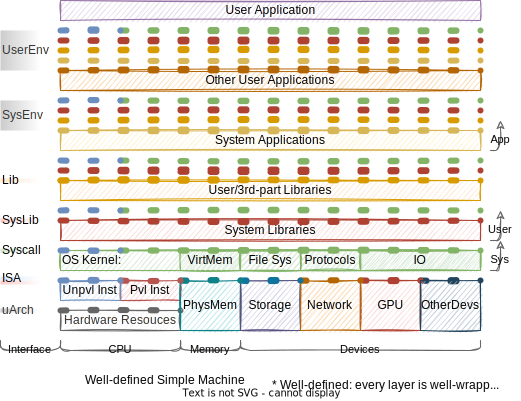

前言：一些用语可参考[Wikipedia: Template:Linux kernel](https://en.wikipedia.org/wiki/Template:Linux_kernel)

2021.07.09

**Guest Interface Upper/Lower**

存在guest可使用转换器提供的最高的层次和最低层次的区别，比如Pin最低可以到ABI层次，最高可以到API层次（Pin提供了自己的libc，即PinCRT）。

**接口图和宝塔图表达能力**

宝塔图：如此可以用层次的宽度和位置，来表示上下层提供的接口关系。比如一个正常的硬件+操作系统+软件层次是一个宝塔形状。下面的这种图（接口图）相比之下太复杂。

还是有问题，某一层次完全遮蔽下层，上层就无法表示出“越级”使用下层。（User Application和Other User Application对下层的以来关系，宝塔图无法表达）

所以这个图（接口图）还是比宝塔图表达能力强。

2021.07.09前

## General Application

### Linux Application

### QEMU

#### WINE

#### Android

|                       With Native Code                       |                          Universal                           |
| :----------------------------------------------------------: | :----------------------------------------------------------: |
|  |  |

### Win Application

